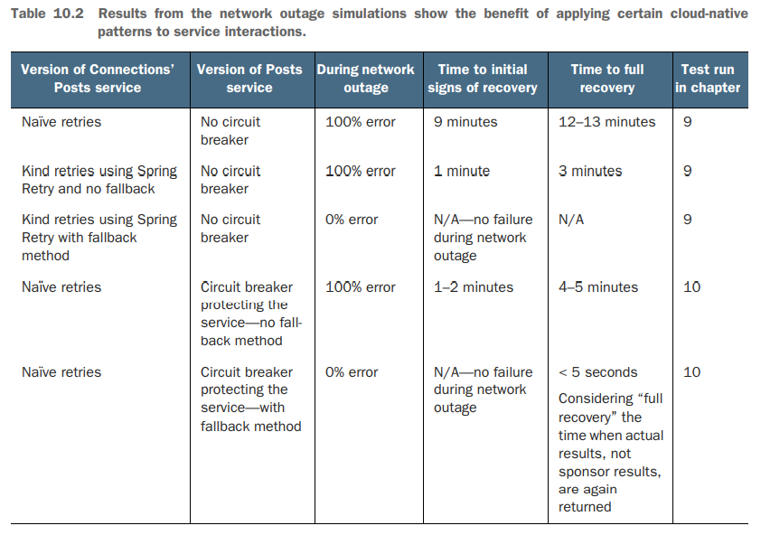
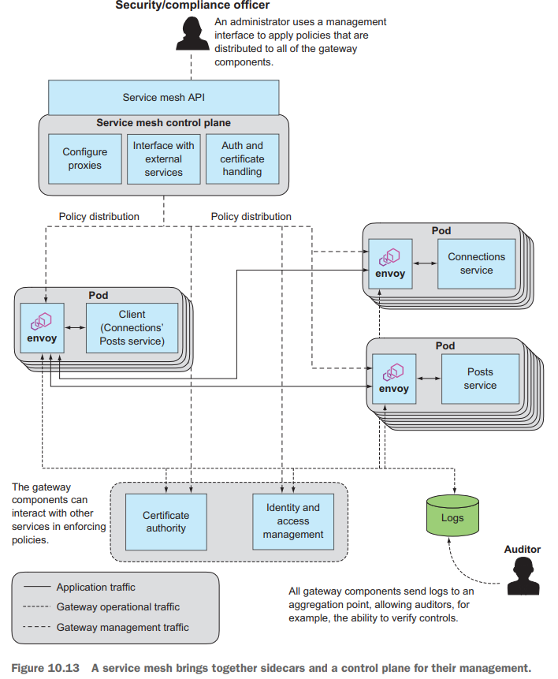

# Cloud Native Patterns - Ch. 10, Fronting services: Circuit breakers and API gateways

## Summary

## Circuit breakers

Circuit breakers protect the service from being overwhelmed when it is
unhealthy.

When load is too high, "the circuit opens" and prevents further traffic.
After some time, allow a request through to see if it succeeds or not
(marking the service as healthy/unhealthy).

A circuit breaker is in one of three states.

- Open: Service is considered unhealthy and no traffic is allowed
  through to the service being protected.
- Closed: Service is healthy and traffic is flowing.
- Half-open: The state where the service is being tested by allowing
  a small number of requests through.

When the circuit is open, the consumer of the information can decide
what to do (serve stale content, no content, or just error).

## API gateways

API gateways sit in front service implementations and provide the
following roles:

- Authentication and authorization
- Encryption of data in flight
- Protect the service from load spikes
- Access logging

API gateways are required for cloud-native software design:

- The componentization of software yields many microservices.
- Change is constant.
- Highly distributed systems must be protected from unexpected volumes
- Fee-based services can be metered/throttled.
- Routing logic for parallel deploys is easily implemented here.

## Service mesh

Avoid embedded components by using sidecars. A sidecar is a process that
runs alongside your main service. Use interprocess
communication/networking (such as pods and Kubernetes) in order to
access these components.

The service mesh is the set of interconnected sidecars (below) and
a control plane which manages those proxies. Implementing everything
we've learned gives us this:

